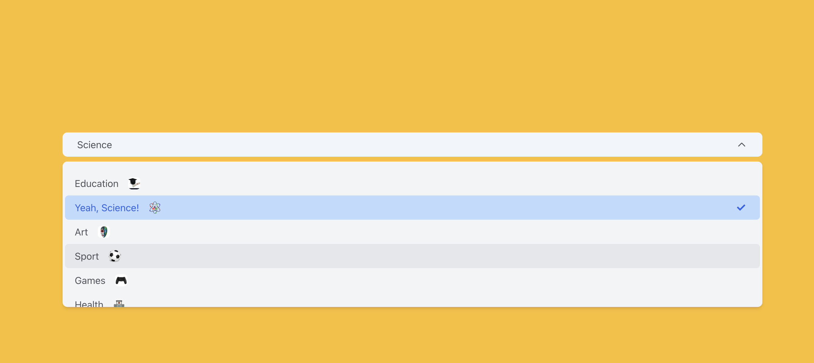
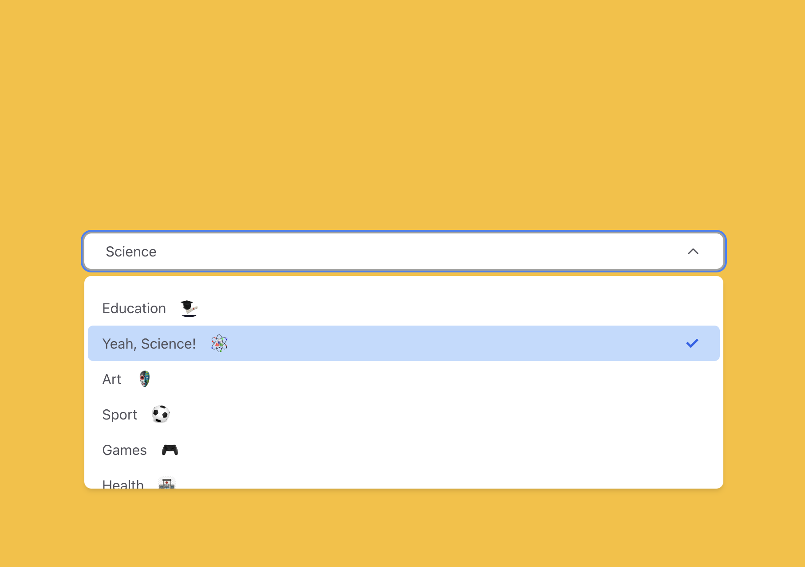
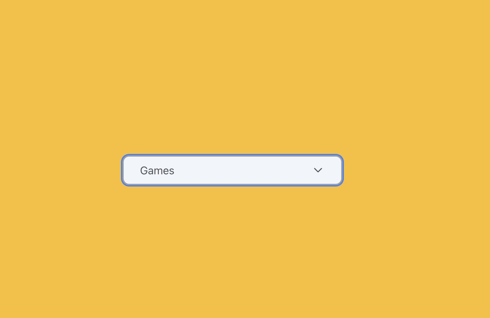
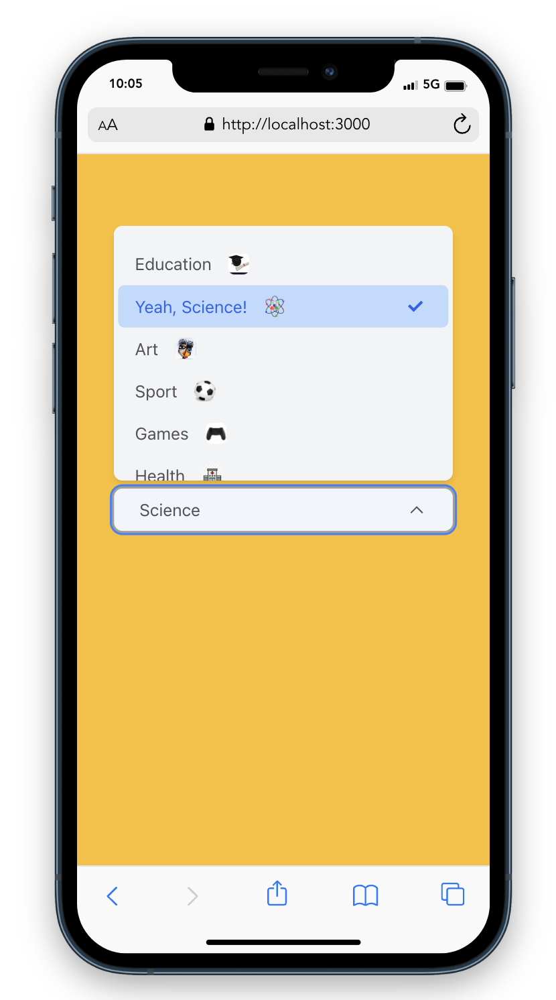
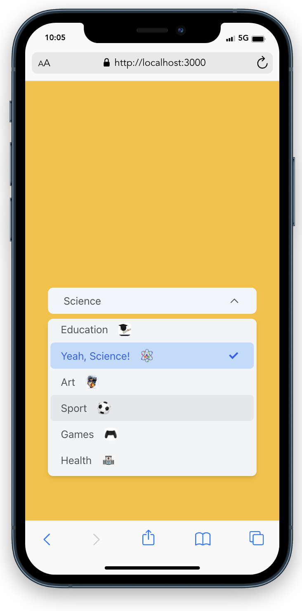
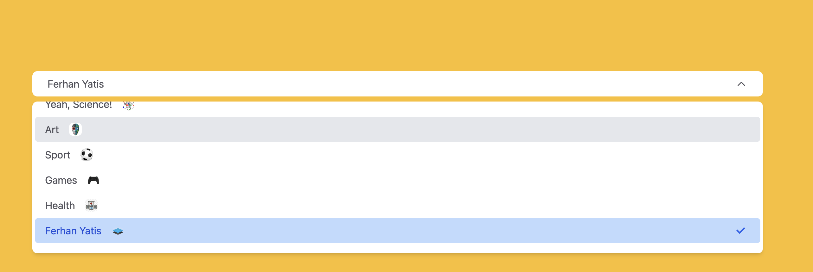
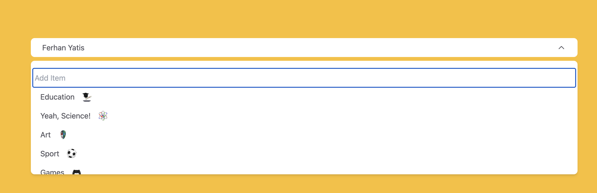
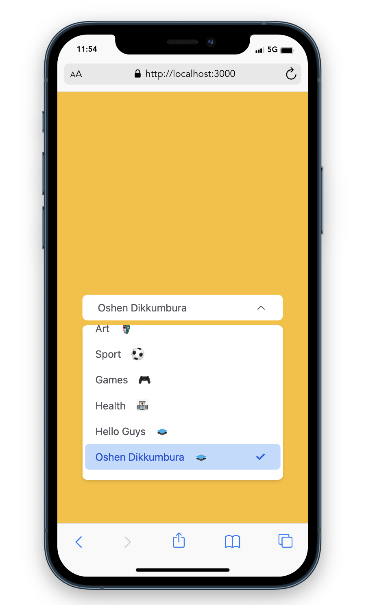

# Getting Started with Create React App

1. Clone the project on your destination
2. Run `npm i`

## Description

I've used React with TypeScript for this project, and I've incorporated both SCSS and Tailwind CSS to make the dropdown menu responsive. It's fully dynamic, and I'm open to any suggestions you might have. Feel free to share your thoughts! Thank you

### `npm run start`

Runs the app in the development mode.\
Open [http://localhost:3000](http://localhost:3000) to view it in the browser.

## Results

### Responsive and Fully Reusable Dropdown

<!DOCTYPE html>
<html>
<head>
</head>
<body>

### Dynamic Width

### Responsive

## You can use this with custom values as well

</body>
</html>

